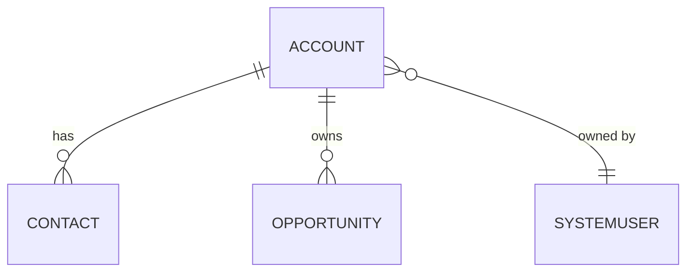
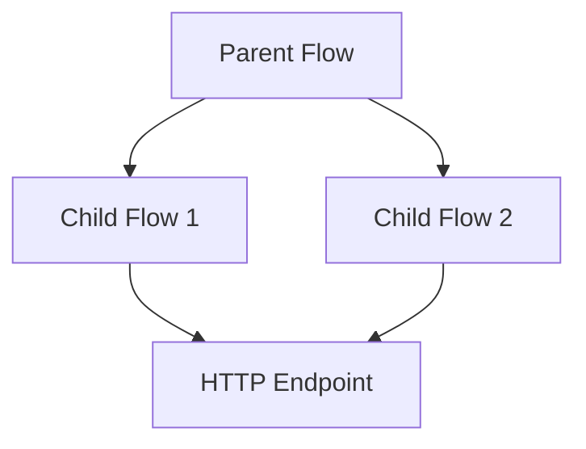

# Dataverse Documentation CLI - Implementation Plan

## Overview

This document outlines the implementation plan for a .NET CLI tool that documents Microsoft Dataverse solutions. The tool extracts metadata and produces human/machine readable outputs for architects, developers, and DevOps pipelines.

Use Test Driven Development approach so the tests are written first before the code.
---

## Phase 1: Project Foundation

### 1.1 Project Setup

**Create .NET Solution Structure:**

```
dataverse-doc/
├── src/
│   ├── DataverseDoc.Cli/              # CLI entry point
│   ├── DataverseDoc.Core/             # Core business logic
│   ├── DataverseDoc.Dataverse/        # Dataverse connector layer
│   └── DataverseDoc.Renderers/        # Output formatters
├── tests/
│   ├── DataverseDoc.Core.Tests/
│   ├── DataverseDoc.Dataverse.Tests/
│   └── DataverseDoc.Integration.Tests/
├── DataverseDoc.sln
└── global.json
```

**Key NuGet Dependencies:**

| Package | Purpose |
|---------|---------|
| `System.CommandLine` | CLI parsing and subcommands |
| `Microsoft.Identity.Client` | MSAL authentication |
| `Microsoft.PowerPlatform.Dataverse.Client` | Dataverse SDK |
| `Spectre.Console` | Console table output |
| `System.Text.Json` | JSON serialization |

### 1.2 Global Tool Configuration

Create `DataverseDoc.Cli.csproj` with:
- `<PackAsTool>true</PackAsTool>`
- `<ToolCommandName>dataverse-doc</ToolCommandName>`
- Target `net8.0` for cross-platform support
- Configure for self-contained publish (Windows, macOS, Linux)

---

## Phase 2: Authentication Layer

### 2.1 Authentication Service Interface

```csharp
public interface IAuthenticationService
{
    Task<string> GetAccessTokenAsync(DataverseConnectionOptions options);
}
```

### 2.2 Interactive Authentication

- Implement OAuth device code flow using MSAL
- Support browser-based login as fallback
- Use delegated permissions scope: `https://{org}.crm.dynamics.com/user_impersonation`

### 2.3 Service Principal Authentication

- Support client secret authentication
- Support certificate-based authentication
- Use application permissions scope: `https://{org}.crm.dynamics.com/.default`

### 2.4 Configuration Hierarchy

Priority order (highest to lowest):
1. CLI flags (`--client-id`, `--tenant-id`, etc.)
2. Environment variables (`DATAVERSE_CLIENT_ID`, `DATAVERSE_TENANT_ID`, etc.)
3. Configuration file (`~/.dataverse-doc/config.json`)

---

## Phase 3: Dataverse Connector Layer

### 3.1 Connection Manager

```csharp
public interface IDataverseClient
{
    Task<T> ExecuteAsync<T>(string query);
    Task<EntityCollection> RetrieveMultipleAsync(string fetchXml);
    Task<JObject> ExecuteWebApiAsync(string endpoint);
}
```

### 3.2 Web API Client

- Base URL: `https://{org}.api.crm.dynamics.com/api/data/v9.2/`
- Implement retry logic with exponential backoff
- Handle rate limiting (HTTP 429)
- Support metadata queries via `$metadata` endpoint

### 3.3 Query Builder

Create FetchXML and OData query builders for:
- Solution component queries
- Entity metadata queries
- Relationship queries

---

## Phase 4: Core Commands Implementation

### 4.1 Command: Environment Variables (`envvars`)

**CLI Syntax:**
```bash
dataverse-doc envvars --solution <name> [--output json|table|markdown]
```

**Implementation:**
1. Query `solutioncomponent` where `componenttype = 380` (Environment Variable Definition)
2. Join with `environmentvariabledefinition` table
3. Fetch current values from `environmentvariablevalue` table

**Web API Endpoint:**
```
environmentvariabledefinitions?$select=displayname,schemaname,type,defaultvalue
&$expand=environmentvariabledefinition_environmentvariablevalue($select=value)
```

**Output Model:**
```csharp
public record EnvironmentVariable(
    string DisplayName,
    string SchemaName,
    string CurrentValue,
    string DefaultValue,
    string Type);
```

---

### 4.2 Command: Security Roles (`roles`)

**CLI Syntax:**
```bash
dataverse-doc roles --solution <name> [--output json|table]
```

**Implementation:**
1. Query `solutioncomponent` where `componenttype = 20` (Role)
2. Join with `role` table for role details
3. Aggregate privileges from `roleprivileges` table

**Web API Endpoint:**
```
roles?$select=name,businessunitid
&$expand=roleprivileges_association($select=privilegeid;$expand=privilegeid($select=name,accessright))
```

**Output Model:**
```csharp
public record SecurityRole(
    string Name,
    string BusinessUnitName,
    Dictionary<string, List<string>> PrivilegesByEntity);
```

---

### 4.3 Command: Queues (`queues`)

**CLI Syntax:**
```bash
dataverse-doc queues --solution <name> [--output json|table]
```

**Implementation:**
1. Query `solutioncomponent` where `componenttype = 2020` (Queue)
2. Join with `queue` table

**Web API Endpoint:**
```
queues?$select=name,queuetypecode,emailaddress
&$filter=_solutionid_value eq '<solution-id>'
```

**Output Model:**
```csharp
public record QueueInfo(
    string Name,
    string Type,  // Public or Private
    bool EmailEnabled);
```

---

### 4.4 Command: Entity Relationship Diagram (`entity-diagram`)

**CLI Syntax:**
```bash
dataverse-doc entity-diagram --entity <logicalname> [--depth 1] [--output mermaid]
```

**Implementation:**
1. Query `EntityDefinitions(LogicalName='<entity>')` metadata
2. Expand `OneToManyRelationships` and `ManyToOneRelationships`
3. Recursively fetch related entities up to specified depth
4. Generate Mermaid ER diagram syntax

**Web API Endpoint:**
```
EntityDefinitions(LogicalName='account')?$select=LogicalName,DisplayName
&$expand=OneToManyRelationships($select=ReferencingEntity,ReferencingAttribute),
         ManyToOneRelationships($select=ReferencedEntity,ReferencedAttribute)
```

**Mermaid Output:**


---

### 4.5 Command: Option Sets (`optionsets`)

**CLI Syntax:**
```bash
dataverse-doc optionsets --solution <name> [--output json|table]
```

**Implementation:**
1. Query global option sets via `GlobalOptionSetDefinitions`
2. Query local option sets via entity attribute metadata
3. Filter by solution components

**Web API Endpoint:**
```
GlobalOptionSetDefinitions?$select=Name,OptionSetType
&$expand=Options($select=Value,Label)
```

**Output Model:**
```csharp
public record OptionSetInfo(
    string Name,
    string Type,  // Global or Local
    List<OptionValue> Options);

public record OptionValue(int Value, string Label);
```

---

### 4.6 Command: Processes (`processes`)

**CLI Syntax:**
```bash
dataverse-doc processes --solution <name> [--output json|table]
```

**Implementation:**
1. Query `solutioncomponent` where `componenttype = 29` (Workflow)
2. Join with `workflow` table
3. Filter by category (0=Workflow, 4=Business Process Flow)

**Web API Endpoint:**
```
workflows?$select=name,category,statecode,statuscode
&$filter=solutionid eq '<solution-id>'
```

**Output Model:**
```csharp
public record ProcessInfo(
    string Name,
    string Type,  // Workflow or BusinessProcessFlow
    string Status);
```

---

### 4.7 Command: Cloud Flows (`flows`)

**CLI Syntax:**
```bash
dataverse-doc flows --solution <name> [--output json|table]
```

**Implementation:**
1. Query `solutioncomponent` where `componenttype = 29` and category = 5 (Modern Flow)
2. Join with `workflow` table
3. Get owner information

**Web API Endpoint:**
```
workflows?$select=name,statecode,_ownerid_value
&$filter=category eq 5 and solutionid eq '<solution-id>'
&$expand=ownerid($select=fullname)
```

**Output Model:**
```csharp
public record CloudFlowInfo(
    string Name,
    string State,  // Active/Inactive
    string Owner);
```

---

### 4.8 Command: Cloud Flow Dependency Diagram (`flow-diagram`)

**CLI Syntax:**
```bash
dataverse-doc flow-diagram --solution <name> [--flow <name>] [--output mermaid]
```

**Implementation:**
1. Query cloud flows in solution
2. Parse flow definition JSON for child flow references
3. Identify HTTP trigger endpoints
4. Build dependency graph
5. Generate Mermaid flowchart

**Mermaid Output:**


---

## Phase 5: Output Renderers

### 5.1 Renderer Interface

```csharp
public interface IOutputRenderer
{
    void Render<T>(IEnumerable<T> data, TextWriter output);
}
```

### 5.2 Implementations

| Format | Class | Library |
|--------|-------|---------|
| Console Table | `TableRenderer` | Spectre.Console |
| JSON | `JsonRenderer` | System.Text.Json |
| Markdown | `MarkdownRenderer` | Custom |
| Mermaid | `MermaidRenderer` | Custom |

### 5.3 Output Destinations

- Console (default)
- File (`--output-file <path>`)
- Stdout for piping (`--quiet` mode)

---

## Phase 6: Error Handling & Logging

### 6.1 Exit Codes

| Code | Meaning |
|------|---------|
| 0 | Success |
| 1 | General error |
| 2 | Authentication failed |
| 3 | Connection error |
| 4 | Invalid arguments |
| 5 | Resource not found |
| 6 | Access denied |

### 6.2 Logging

- Use `Microsoft.Extensions.Logging`
- Default: Errors only
- `--verbose`: Info level
- `--debug`: Debug level

### 6.3 Error Messages

- User-friendly messages to stderr
- Include actionable guidance
- Technical details in verbose mode

---

## Phase 7: Testing Strategy

### 7.1 Unit Tests

- Authentication service mocking
- Query builder validation
- Output renderer verification
- Command parsing tests

### 7.2 Integration Tests

- Use Dataverse test environment
- Verify actual API responses
- Test authentication flows

### 7.3 End-to-End Tests

- Full CLI execution
- Pipeline simulation
- Multi-platform verification

---

## Phase 8: CI/CD & Distribution

### 8.1 Build Pipeline

```yaml
trigger:
  - main

stages:
  - stage: Build
    jobs:
      - job: Build
        steps:
          - task: DotNetCoreCLI@2
            inputs:
              command: build
          - task: DotNetCoreCLI@2
            inputs:
              command: test
          - task: DotNetCoreCLI@2
            inputs:
              command: pack

  - stage: Publish
    jobs:
      - job: PublishNuGet
        steps:
          - task: NuGetCommand@2
            inputs:
              command: push
```

### 8.2 Distribution Methods

1. **NuGet Global Tool:**
   ```bash
   dotnet tool install -g dataverse-doc
   ```

2. **Standalone Executables:**
   - Windows x64
   - macOS x64/ARM64
   - Linux x64

3. **Container Image:**
   ```dockerfile
   FROM mcr.microsoft.com/dotnet/runtime:8.0
   COPY ./publish /app
   ENTRYPOINT ["/app/dataverse-doc"]
   ```

---

## Implementation Order

| Priority | Component | Estimated Effort |
|----------|-----------|------------------|
| 1 | Project structure & CLI scaffolding | Foundation |
| 2 | Authentication layer (both modes) | Critical |
| 3 | Dataverse connector with Web API | Critical |
| 4 | Environment Variables command | First feature |
| 5 | Table & JSON renderers | Core output |
| 6 | Security Roles command | Feature |
| 7 | Queues command | Feature |
| 8 | Option Sets command | Feature |
| 9 | Processes command | Feature |
| 10 | Cloud Flows command | Feature |
| 11 | Entity Relationship Diagram | Diagram feature |
| 12 | Cloud Flow Dependency Diagram | Diagram feature |
| 13 | Markdown renderer | Additional output |
| 14 | Error handling & logging | Polish |
| 15 | Unit & integration tests | Quality |
| 16 | CI/CD pipeline | Distribution |
| 17 | Documentation & samples | Completion |

---

## Environment Variables Reference

| Variable | Purpose |
|----------|---------|
| `DATAVERSE_URL` | Dataverse environment URL |
| `DATAVERSE_AUTH_MODE` | `interactive` or `serviceprincipal` |
| `DATAVERSE_TENANT_ID` | Azure AD tenant ID |
| `DATAVERSE_CLIENT_ID` | Application (client) ID |
| `DATAVERSE_CLIENT_SECRET` | Client secret (for SP auth) |
| `DATAVERSE_CERTIFICATE_PATH` | Certificate file path |
| `DATAVERSE_CERTIFICATE_PASSWORD` | Certificate password |

---

## Security Considerations

1. Never write secrets to disk or logs
2. Use secure credential storage where available
3. Support Azure Key Vault integration for pipeline secrets
4. Validate all user inputs
5. Use HTTPS for all API calls
6. Implement proper token caching with secure storage

---

## Success Criteria Checklist

- [ ] Authenticate interactively via device code
- [ ] Authenticate via service principal (secret)
- [ ] Authenticate via service principal (certificate)
- [ ] Extract environment variables from solution
- [ ] Extract security roles with privileges
- [ ] Extract queues from solution
- [ ] Extract option sets (global and local)
- [ ] Extract classic workflows and BPFs
- [ ] Extract cloud flows with owner info
- [ ] Generate entity relationship Mermaid diagram
- [ ] Generate cloud flow dependency Mermaid diagram
- [ ] Output as console table
- [ ] Output as JSON
- [ ] Output as Markdown
- [ ] Run in Azure DevOps pipeline
- [ ] Fail with proper exit codes
- [ ] Provide verbose diagnostics
- [ ] Install as .NET global tool
- [ ] Run as standalone executable on Windows/macOS/Linux
